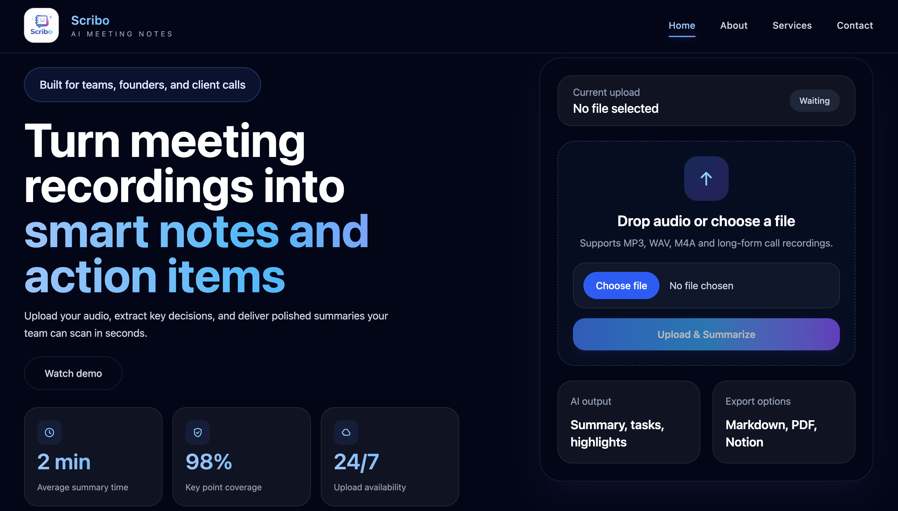
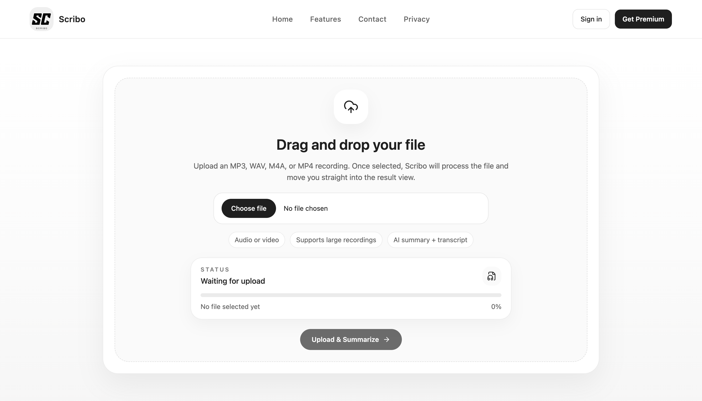
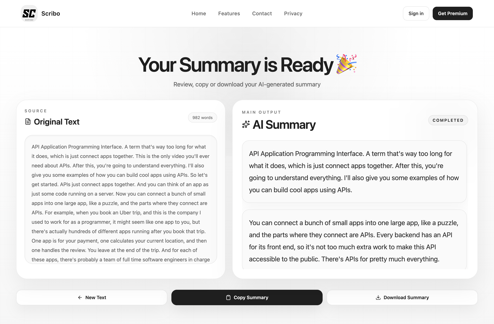
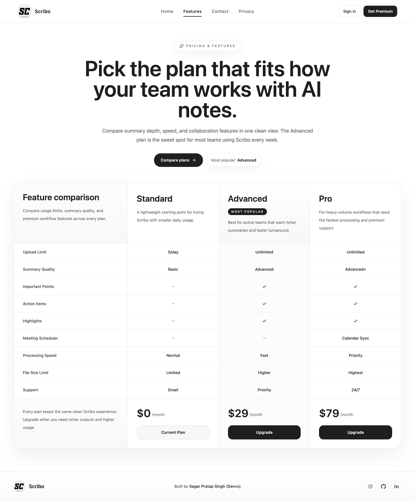
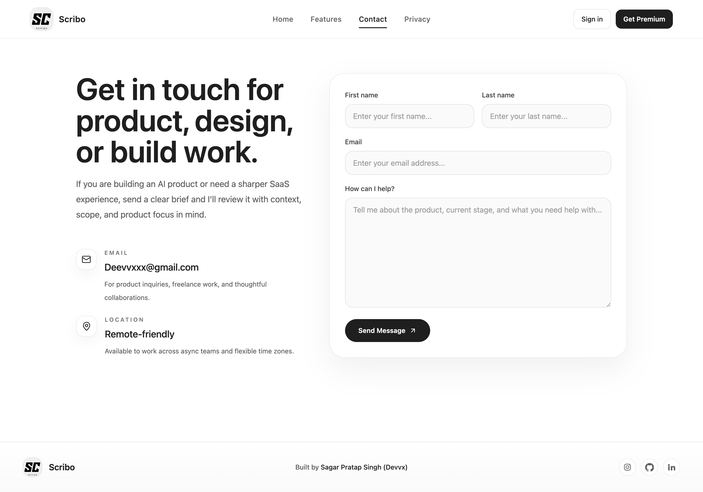

# Scribo

Scribo is an AI meeting summarization app that turns uploaded audio or video into transcripts, summaries, highlights, and action items.

## Overview

- Frontend: React + Vite + Tailwind CSS + Framer Motion
- Backend: Node.js + Express + Multer + Nodemailer
- AI processing: AssemblyAI
- Deployment target: Vercel for the client and Render for the server

## Screenshots

### Home



### Upload



### Results



### Features



### Contact



## Features

- Upload `MP3`, `WAV`, `M4A`, and `MP4` meeting files
- Generate transcripts and AI summaries
- Review formatted results in a dedicated results page
- Copy or download the generated summary
- Browse a pricing/features page for plan comparison
- Send inquiries through the contact form
- Includes backend protections like `helmet`, rate limiting, upload validation, and token-based upload access

## Project Structure

```text
ai-meeting-app/
├── client/    # React + Vite frontend
└── server/    # Express API
```

## Local Setup

### 1. Clone the repository

```bash
git clone https://github.com/DevvSagar/ai-meeting-app.git
cd ai-meeting-app
```

### 2. Install frontend dependencies

```bash
cd client
npm install
```

### 3. Install backend dependencies

```bash
cd ../server
npm install
```

### 4. Configure environment variables

Create `client/.env`:

```env
VITE_API_URL=http://localhost:5001
VITE_UPLOAD_TOKEN=your_secure_upload_token_here
```

Create `server/.env`:

```env
ASSEMBLY_API_KEY=your_assemblyai_api_key_here
UPLOAD_ACCESS_TOKEN=your_secure_upload_token_here
EMAIL_USER=your_gmail_address@gmail.com
EMAIL_PASS=your_gmail_app_password
FRONTEND_URL=http://localhost:5173
PORT=5001
NODE_ENV=development
MAX_AUDIO_UPLOAD_SIZE_MB=250
MAX_VIDEO_UPLOAD_SIZE_MB=100
```

### 5. Start the backend

```bash
cd server
npm run dev
```

### 6. Start the frontend

```bash
cd client
npm run dev
```

The app will run on `http://localhost:5173` and the API will run on `http://localhost:5001`.

## App Flow

1. Open the frontend.
2. Upload an audio or video file from the app page.
3. The backend validates the file and forwards it to AssemblyAI.
4. Scribo returns the transcript and summary.
5. Review, copy, or download the result.

## Security Notes

- `helmet` for safer HTTP headers
- `cors` restricted by configured frontend URL
- Rate limiting on API routes
- File type and file size validation
- Upload token check via `x-upload-token`
- SSRF protection when handling external URLs from AssemblyAI

## Deployment

- Client: Vercel
- Server: Render

## Author

Sagar Pratap Singh

- GitHub: [DevvSagar](https://github.com/DevvSagar)
- LinkedIn: [devvsag](https://www.linkedin.com/in/devvsag)
